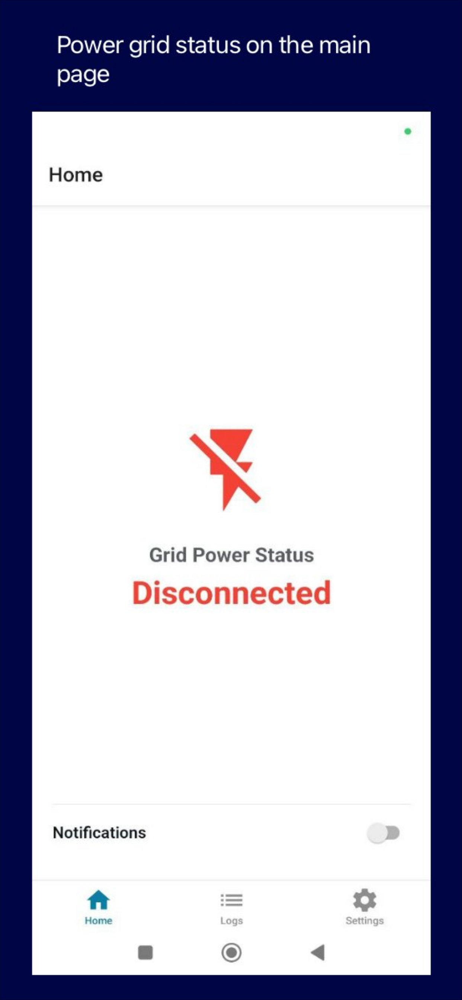
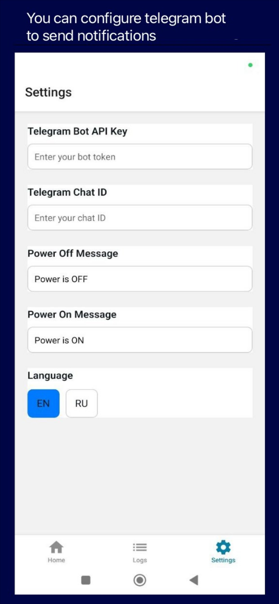
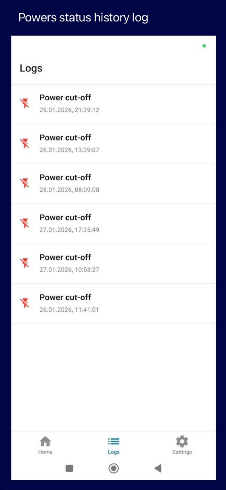

# Power Cut-off Detector Application

The primary feature is to detect grid power-off events.
There are no reliable devices on the market that can cope with this.
A mobile phone with the app installed should be plugged into a power outlet. If grid power goes down, the application sends a message via a Telegram bot.

Currently implemented features: 
- send telegram bot message when power is off or on (supports multiple chat IDs) 
- error logging for failed Telegram notifications with 3 retry attempts per chat ID
- visual logs tab for monitoring power events and errors 

## Screenshots






## TODO list

Automatically send a request to the Tuya API to shut down the power switch when power is off. Such behavior is required when your home is powered by solar panels and grid power. If grid power is not available, you want to switch off some power-consuming devices.

## Development notes

In order to run the application in debug mode use `npx expo start --tunnel`

## Build Android APK locally (no EAS)

This project is an Expo app. To build **locally**, we generate the native Android project and use Gradle.

### 1) Generate the native Android project (first time, or after native config changes)
`bash npx expo prebuild -p android`

This creates an `android/` folder (native Gradle project).

### 2) Build an APK

#### Debug APK (quickest; installable on devices with USB debugging)
```
cd android 
gradlew.bat assembleDebug
```

APK output:
`npx expo run:android`
- `android\app\build\outputs\apk\release\app-release.apk`

`bash cd android gradlew.bat assembleRelease`
## Building with Expo CLI in the cloud

To build AAB file:
`npx eas-cli build --platform android --message "First expo build"`

To build APK file:
`npx eas-cli build --platform android --profile preview` 
